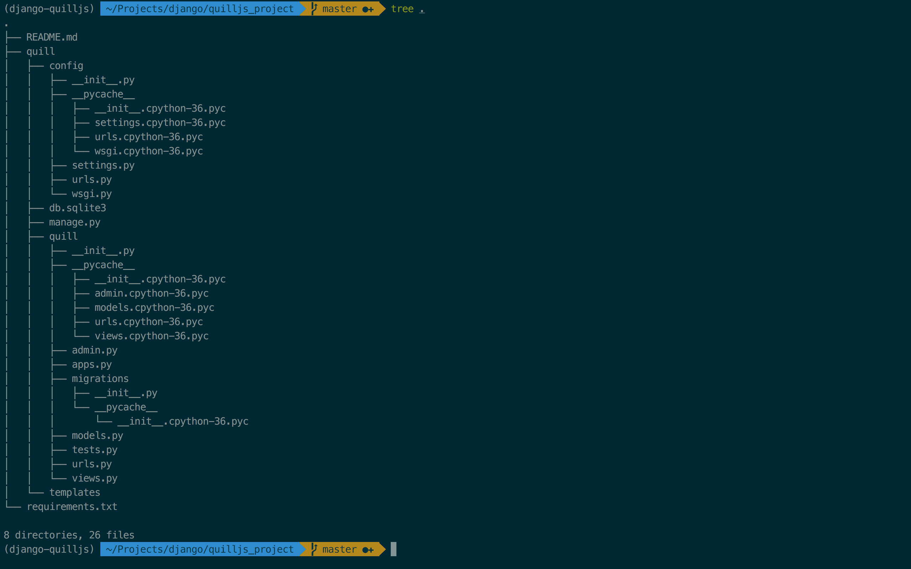

# Practicing Quilljs; powerful, rich text editor

[quilljs official homepage](https://quilljs.com/)

### Python Version: 3.6.2

## 프로젝트명: Django 와 Quilljs를 사용하여 brunch 풍의 블로그 구현

#### 목적: 다른 Text Editor와 차별적인,  QuillJS의 Delta 객체 실습
#### Delta를 활용해, 텍스트 에디터 컨텐츠의 임시저장, 발행 기능 구현

## 공부할 내용

### 1. AJAX의 개념, 이 request를 Django View에서 처리하는 방법
### 2. Text Editor를 구성하는 개념 및 기술 기반 학습
### 3. Delta의 autosave, form-submit, 학습

## 의의
### 처음으로 외부 api 영어 문서를 깊게 공부하고 실습해보는 프로젝트

## 프로젝트

## html은 django model.py에서 TextField에 저장하며, 위험한 스크립트가 들어갈 수 있기에, 이는 반드시 sanitizing을 해야 한다.

## Escaped html? sanitized html?


## 0. 검색, 검색, 그리고 실험

#### 처음 접하는, 어떤 API를 프로젝트에 도입하고자 한다면, 해당 API의 문서, 튜토리얼을 모두 실습하고, 해당 공식 github에서 이루어지고 있는 개발자들의 피드백을 훑어보며, 주의할 점, 해당 API의 장/단점, 그리고 다른 유사 API와의 비교점들에 대해 파악한 후, 자신의 Project를 위한 최선의 구조/기술을 파악한 후 프로젝트에 들어가자!


## 1. django project을 git과 연동하고, project 구조 setup하기
[github-commit](https://github.com/namu617/quilljs/tree/e4aa9d8a306bdbe66e2769c8acda39e1a77e47bc)



## 2. Big Picture 그리기(views.py기준)
### 어떤 기능들이 있는지(page(GET Request), action(POST Request) 로 url 과 그에 해당하는 기능을 할 view 연동시키기
[github-commit](https://github.com/namu617/quilljs/tree/e222996886894ba7a9988e83f036441100cc6967)

#### 2-1) urls.py - views.py를 연결하여, HttpResponse 만을 사용해, 어떤 url로 접속했을 때 어떤 view의 기능이 실현되는가를 먼저 정리해서 전체적인 프로젝트의 틀을 잡았다.


#### 2-2) 각 url로 접속했을 때 브라우저에 찍히는 HttpResponse 기능 정의 설명


# 3. ERD(개체-관계 다이어그램) 그리기

[lucid chart](https://www.lucidchart.com/) 라는 다이어그램 디자인 툴을 이용하여, models.py 에 바로 코딩을 하기 전에, 실수를 방지하기 위해 미리, ERD를 설계한다.
 


# 4. models.py에 model 작성

[github-commit](https://github.com/namu617/quilljs/tree/e4aa9d8a306bdbe66e2769c8acda39e1a77e47bc)

완성된 ERD를 바탕으로 app 안의 models.py에 model을 작성한다.
모든 attribute(속성)들과 더불어, view에서 필요할 것 같은, 함수로 호출하면 편할, 기능들도 method(메서드)로 최대한 정의해본다. 이후 메서드가 더 필요하면, migrate를 하지 않고도 메서드들을 원없이 추가할 수 있기에 지금 크게 걱정은 하지 않아도 된다.


### 4-1) author는 auth.User의 foreignkey를 받아올 `ForeignKey`

###### User Model에 대해서 학습하는데 의의를 둔 프로젝트가 아니므로, user는 그냥 auth.User에서 superuser인 관리자 한 명을 default로 가져와 그 사람이 모든 post를 작성한다고 가정한다.

### 4-2) title은 글을 쓸 텍스트 에디터 공간 상단에, 유저가 입력할 글의 제목을 담을 `CharField`

### 4-3) delta_content는, "quill text editor가 비어있다고 가정했을 때, `insert`를 통해 ~을 채워넣으라는 지시(변화)"를 담은, JSON 형태로 이루어진, quilljs만의 특별한 Delta(quilljs 만의 data format)객체를 담을 `JSONField`

[JSONField Django Docs](https://docs.djangoproject.com/ko/1.11/ref/contrib/postgres/fields/#django.contrib.postgres.fields.JSONField)

###### Delta 객체의 예시)
###### - insert는 html의 text, image 등의 구성요소, attribute은 html formatting 값을 담고 있다.

```
{
  ops: [
    { insert: 'Gandalf', attributes: { bold: true } },
    { insert: ' the ' },
    { insert: 'Grey', attributes: { color: '#cccccc' } }
  ]
}
``` 

***1)`JSONField` 의 값을 optional(빈 값 입력 가능)하게 하려면, `CharField`나 `TextField`의 `blank=True`의 경우 생기는 빈 값을 `''`로 인식하는 것과 다르게 `JSONField`의 경우에는 `blank=True`로 생기는 빈 값을 `None`으로 인식하기 때문에, 오류를 피하려면, `blank=True, null=True`를 모두 해줘야 한다.***
[whats-the-convention-for-using-jsonfield-native-postgres-jsonb](https://stackoverflow.com/questions/36209336/in-django-1-9-whats-the-convention-for-using-jsonfield-native-postgres-jsonb) 

***2) `JSONField` 를 사용하려면 DB를 sqlite3가 아닌 postgresql로 바꿔야 한다.*** [djangogirls-PostgreSQL 설치하기](https://jinpark-dg.gitbooks.io/django-girls-extended-tutorial-korean/content/optional_postgresql_installation/index.html)

***3) `JSONField` 를 사용하려면 `pip install psycopg2`를 해준 후, `JSONField`를 `import` 해줘야 한다.***


***4) 또한, `JSONField`안에, `Delta 객체`를 담기 위해서는 반드시 이를 `JSON.stringify(Delta 객체)`를 해줘야 한다.***


### 4-4) html_content는, 최종적으로 저장 또는 발행된 quill editor안의 formatting이 적용된 html 파일을 담을 `TextField`

***- 이 때, text editor에서 사용자가 작성한 html을 TextField에 저장할 때는, 위험한 스크립트(ex) 악의적 javascript)가 들어갈 수 있으니 꼭 sanitizing 해줘야 하는 것을 잊지말자!***

[html sanitizing library - "Bleach"](https://github.com/mozilla/bleach)

[html sanitizing library - "django-html_sanitizer"](https://github.com/ui/django-html_sanitizer)

##### - html을 DB에 저장하고 이를 추출할 때는, sanitizing(DB에 저장할 때), escaping(DB에서 추출할 때) 을 신경써야 한다!


### 4-5) created_date은 가장 처음 Post가 생성된 시간을 담는 `DateTimeField`

### 4-6) published_date은 Post가 최종적으로 수정된 시간을 담는 `DateTimeField`

---
### 모델링을 완료한 후, `./manage.py makemigrations, migrate`, 그리고 `./manage.py shell_plus`를 통해, 가상의 한 `Post Object`을 생성한 후, 이가 DB에 원하는 format으로 저장이 잘되는지 확인한다.


# 5. quill editor 자리 잡아 놓기

### 본격적인 코딩에 앞서, 시각적으로 어떤 구조일까를 확인하기 위해서, 가장 기본적인 형태의 quill-editor를 `post_form.html`에 표시하고 시작하자.

### 이를 위해, `post_form.html`에, quill-editor가 차지할 영역인 `<div id="editor-container"></div>`를 잡은 후, css로 적절한 `height`를 주고, quill cdn에서 불러온 Quill객체를 이용하여 `script`로 `div` 부분을 quill-editor로 바꿔준다.


# 6. 스토리보드 작성(Web App Page Flow 파악)


### view의 로직은 특히나, 나중에 UX와 밀접하게 연관되어 있으므로, 어떤 버튼을 클릭했을 때, 어떤 작용을 하고, 어떠한 경우에는 page-reloading 이 유저에게 불편함을 주므로, AJAX request로 처리해야 하고... 등 스토리보드를 잡아, 모든 시나리오를 구체적으로 생각한 후에 코딩에 들어가는 것이 맞다.

### 글을 쓰는 플랫폼의 경우, 국내에서는 압도적으로 "브런치"가 소위 '글쟁이(?)'들에게는 글쓰기 좋다고 호평이 자자한 만큼, UX는 브런치의 에디터를 벤치마킹하기로 했다.


### 유저들이에게, 이미 검증된 서비스의 벤치마킹, 또는 Cloning을 해보는 작업은, 어떠한 점들을 전문가들이 염두에 두고 서비스를 기획했는가에 대해 짧은 시간에 공부할 수 있는 최고의 방법인 것 같다.


## 브런치(brunch)의 경우, 다음의 중요한 큰 흐름을 지니고 있다.

# 1. 글쓰기(Create) 페이지


#### 글을 처음 생성하는 페이지; 즉, django에서 생각해보면 처음으로 Post Model 객체를 생성한 후, 이를 DB에 `save`하는 페이지이다.

이 경우 User의 action을 유도하는 두 개의 버튼이 있는데, 하나는 저장 버튼 다른 하나는 작가신청 버튼인데, 필자는 아직 작가신청을 하지 않아서 뜨는 것으로, 본 프로젝트에서는 작가신청을 '출판'버튼으로 바꿔서 만들기로 했다.

## 1-1) 저장 버튼

유저의 관점에서 생각해보자. 유저는 보통 언제 글을 저장할까? 저장을 하고 컴퓨터에서 장시간 자리를 비우고 싶어하는 경우도 물론 있겠지만, 보통의 일반적인 경우, 유저는 **글을 쓰는 도중**, 글이 날아가는 것을 방지하기 위해서 **중간중간 저장**을 한다.

즉, 유저가 저장을 한다는 것은, **저장을 한 직후에 계속 글을 또 써나갈 수 있게 텍스트 에디터가 페이지에 보여야 한다는 것**이다.

브런치에서 볼 수 있듯, 브런치는 처음 글을 생성하는 페이지(/write)와, 다른 기능(django의 경우 url-view)을 가지는 글을 수정하는 페이지(/username/pk/write)는 구분했다.

정리하자면, 
#### 중요한 점은, 유저가 처음 글을 생성하고, 이를 저장을 한 경우에는, 해당 페이지에서 AJAX post request로 해당 페이지에 그대로 머무는 것이 아니라, 이미 생성이 되어 DB에 저장이 완료된 글을 수정하는 페이지로 넘어가야 한다는 것이다.

이렇게 설계해야 하는 것은 어찌 보면 당연하다.

##### 1) 글을 생성, 수정하는 기능은 엄연하게 django의 경우 CreateView, UpdateView로 다른 기능을 하므로 서로 다른 url-view에서 처리해야 하며, 

##### 2) 이 수정 페이지는 생성 페이지와는 다르게 글쓴이가 이미 생성한, 저장 혹은 출판된 글 목록에서 링크로 연결되어 있어야 하기 때문이다. 그래서 언제든 유저가 글을 수정하고 싶다면, 수정버튼 등을 클릭해 해당 수정 페이지로 이동해, 유저가 이미 과거에 작성했던 내용을 DB에서 불러와서 채워넣은 텍스트 에디터를 띄워줄 수 있어야 한다.


## 1-2) 출판 버튼

저장/출판 모두, DB에 새로 생성된 글(Post)을 저장하는 것이지만, 저장과 달리 출판의 경우는 Post Model Class의 publish 메서드를 통해서 `published`라는 `BooleanField(default=False)`를 `True`로 바꿔, 후에 

**1. 저장된 글 목록**

**2. 출판된 글 목록**

의 서로 구분된 페이지를 통해서 유저가 글을 관리할 수 있게 해준다.


# 2. 글수정(Update) 페이지


#### 글을 수정하는 페이지; 즉 django에서 생각해보면 이미 DB 속에 record로 저장되어 있는 특정 유저의 몇 번째 Post를 `get`으로 갖고와, attriubte을 수정한 후, 이를 DB에 다시 `save`하는 페이지이다.


#### 여기서, 브런치 에디터의 뛰어난 UX가 느껴지는데, 크게 2가지 포인트로 나눌 수 있다.

## 2-1) 수정 페이지라는 새로운 페이지로 이동시키는 생성 페이지의 저장 버튼과는 달리, 수정 페이지에서 저장을 하는 경우, 페이지 리로딩 없이 AJAX post request를 통해서 글을 저장할 수 있다.

글을 수정하며, 자주 저장을 할텐데, **저장을 할 때마다, 페이지가 리로딩되면, 글쓴이는 얼마나 화가 날까?**

AJAX를 처음 사용해보는 나의 입장에서, **"이러한 경우가 AJAX를 써야 하는 좋은 유저 케이스구나"** 라는 것을 직접 체감할 수 있어 좋았던 것 같다.


## 2-2) *"저장을 한 직후"* 에는, "작가의 서랍 가기"라는 저장된 글 목록 으로 유저를 이동시키는 버튼이 뜨지만, *"저장을 한 시점으로부터 또 글을 수정한 경우"* 에는 이를 텍스트 에디터가 내부 컨텐츠의 변화를 인식해, 다시 저장을 권유하는 저장 버튼을 유저에게 동적으로 보여준다.

**글을 쓰며, 현재까지 쓴 글이 저장이 되었는지, 안되었는지를 잘 기억하지 못하는 유저에게 실시간으로 알려준다.** 얼마나 친절한 기능인가? 저장이 최종적으로 언제 되었는지 시간을 찍어서 보여줘, 유저의 최종적인 저장 시각을 알려주며, 또 저장을 하도록 권유하여, 글이 전부 날아가버리는 불상사를 미연에 방지하는 것이다.

**이 기능을 구현하는 것이 어렵지 않을까 걱정했는데, 다행히도 쓰려는 quilljs API에는, 텍스트 에디터 내부의 변화를 event로 감지해 특정 function을 trigger시킬 수 있는 `text-change`기능이 API 문서에 친절히 설명되어 있었다. 이에서 더 나아가, 원한다면, `setInterval`을 통해 특정 시간 주기로 글을 자동으로 저장해주는 `autosave`기능도 구현할 수 있다.**

[quilljs 'text-change' 사용 케이스](https://quilljs.com/playground/#autosave)


# 7. views.py에 로직 작성

### 드디어 본격적인 코딩에 들어가, 백-엔드에서 담당할 모든 로직들을 코딩한다.


## 7-1) 글쓰기(생성) 및 글수정 페이지 구현

#### 1. 글쓰기 페이지에(/write)서 글을 처음으로 저장한 경우, 해당 username과 pk를 담은 url인, 글수정 페이지(/markkim/1/write)로 연결

#### 2. 글수정 페이지에서 저장을 하는 경우, `post_edit` view로 AJAX post request 보내기

### API (quilljs)

1) 처음, 글 수정 페이지로 이동한 경우, 해당 글의 정보를 DB에서 받아와 이를 quill 텍스트 에디터에 `setContents` API function을 통해 채워넣어, 유저에게 보여주기

```
// 작성하던 기존 post 내용(Delta) 불러오기
quill.setContents(JSON.parse("{{ post.delta_content | escapejs }}"));
```
- 이 때, {{ }} django template variable tag는 자동적으로 JSON Strinified object를 escape해버리기 때문에, 이를 `|escapejs` filter 를 적용해야지 원본이 훼손되지 않고 꺼낼 수 있으며, 이를 stringified object를 다시 JSON object 로 바꾸기 위해 `JSON.parse()`를 해줘야 한다.\

### 이 때, JSON data 를 template에 나타낼 때는, sanitization을 염두에 둬야 한다! [django json-sanitization](https://gist.github.com/amacneil/5af7cd0e934f5465b695)


2) click을 하는 경우, quill editor 내의 컨텐츠를 delta객체로 hidden type의 input의 value에 담기

이 때, `getContents()`로 얻은 Delta객체는 JSON 포맷이므로, 이를 value에 담아 보낼 떄는 반드시 `JSON.stringify()`를 통해 문자열화하여 보내야 한다.
 

 


## 7-2) 글쓰기(생성) 및 글수정 페이지 구현

